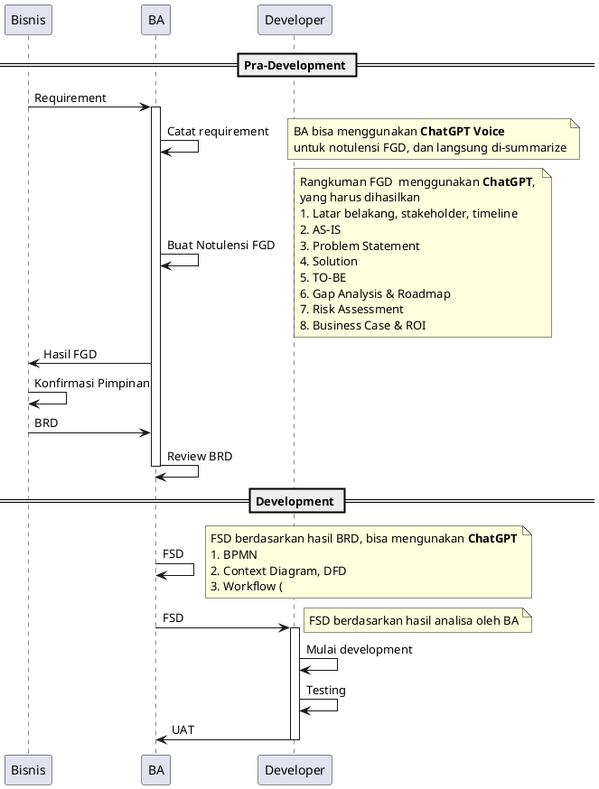

```plantuml
@startuml
== Pra-Development ==
Bisnis -> BA: Requirement

activate BA
BA -> BA: Catat requirement 
note right
BA bisa menggunakan <b>ChatGPT Voice </b>
untuk notulensi FGD, dan langsung di-summarize
end note
BA -> BA: Buat Notulensi FGD
note right
Rangkuman FGD  menggunakan <b>ChatGPT</b>, 
yang harus dihasilkan
1. Latar belakang, stakeholder, timeline
2. AS-IS 
3. Problem Statement
4. Solution 
5. TO-BE
6. Gap Analysis & Roadmap
7. Risk Assessment
8. Business Case & ROI
end note

BA -> Bisnis : Hasil FGD
Bisnis -> Bisnis : Konfirmasi Pimpinan
Bisnis -> BA : BRD 
BA -> BA : Review BRD
 

deactivate BA

== Development == 
BA -> BA: FSD
note right
FSD berdasarkan hasil BRD, bisa mengunakan <b>ChatGPT</b>
1. BPMN
2. Context Diagram, DFD
3. Workflow (
end note

BA -> Developer : FSD 
note right
FSD berdasarkan hasil analisa oleh BA
end note

activate Developer
Developer -> Developer: Mulai development
Developer -> Developer: Testing
Developer -> BA : UAT
deactivate Developer
@enduml

```
